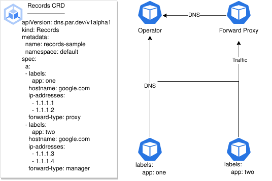

# Par - Label Based DNS Operator


[](https://opensource.org/licenses/MIT)
[](https://github.com/jmcgrath207/par/actions)

Par is a DNS operator that allows you to control deployment DNS queries by labels without cluster administrative changes (ex. [Istio sidecar](https://istio.io/latest/docs/setup/platform-setup/prerequisites/#:~:text=Istio%20proxy%20sidecar%20container) )

It accomplished this by changing the DNS policy of a deployment to point to the Operator IP address then associating a client ID to pod ip addresses. This allows you to control the scope DNS response to a deployment's label.



[Records Custom Resource Example](./tests/resources/test_dns_v1alpha1_records.yaml)


### Forward Type

### Manager
This type will update deployment pod template DNS configuration to the Operator's IP address and all DNS queries will be forwarded to the Operator. Once a DNS request is received, it will check the Records Custom Resource if a entry exist. If no entry is found it will default to the cluster's DNS.

Only the Records Custom Resource is needed for this configuration.

### Proxy

The same initial setup happens as the Manager forward type, expect for that any DNS A Record Query will always return the proxy IP address. This will then force pod traffic through the proxy and from there the proxy will preform a DNS lookup from the Operator. In theory, any forward proxy can be used with this method.


#### Setup

The proxy deployment will need this label
```yaml
  par.dev/proxy: "true"
```

and for the proxy configmap this label.

```yaml
  par.dev/proxy-config: "true"
```

Inside the configmap will you need to add a go template tag `.dnsResolver` with the backticks like below. This is so the Operator can render the Operator address in the configmap and forward DNS queries to the Operator.

```yaml
serverBlock: |-
  server {
      listen 8080;

      location / {
          resolver {{ `{{ .dnsResolver }}` }};
          proxy_pass http://$http_host$request_uri;
          proxy_ssl_server_name on;
      }
  }
```

[example nginx configuration](tests/resources/test_proxy.yaml)

Then deploy your Records custom resource. ## Helm Install

```bash
helm repo add par https://jmcgrath207.github.io/par/chart
helm install par par/Par
```

## Values

| Key | Type | Default | Description |
|-----|------|---------|-------------|
| image.repository | string | `"ghcr.io/jmcgrath207/par"` |  |
| image.tag | string | `"v0.1.0"` |  |
| kubernetesClusterDomain | string | `"cluster.local"` |  |
| metrics | bool | `false` |  |
| requests.cpu | string | `"256m"` |  |
| requests.memory | string | `"128Mi"` |  |
| resources.limits.cpu | string | `"1"` |  |
| resources.limits.memory | string | `"512Mi"` |  |

## Contribute

### Run locally
```bash
make deploy_local
```

### Run locally with Delve Debug
```bash
make deploy_debug
```
Then connect to `localhost:30002` with [delve](https://github.com/go-delve/delve) or your IDE.

### Run e2e Test
```bash
make deploy_e2e
```

### Debug e2e
```bash
make deploy_e2e_debug
```
Then run a debug against [deployment_test.go](tests/e2e/deployment_test.go)

## License

This project is licensed under the [MIT License](https://opensource.org/licenses/MIT). See the `LICENSE` file for more details.